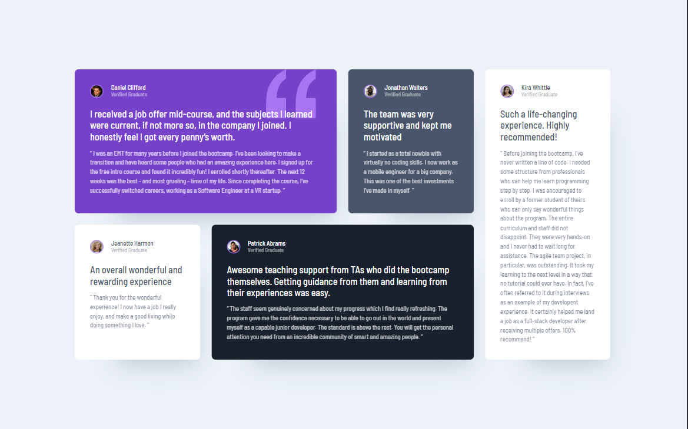

# Frontend Mentor - Testimonials grid section solution

This is a solution to the [Testimonials grid section challenge on Frontend Mentor](https://www.frontendmentor.io/challenges/testimonials-grid-section-Nnw6J7Un7). Frontend Mentor challenges help you improve your coding skills by building realistic projects.

## Table of contents

- [Overview](#overview)
  - [The challenge](#the-challenge)
  - [Screenshot](#screenshot)
  - [Links](#links)
- [My process](#my-process)
  - [Built with](#built-with)
  - [What I learned](#what-i-learned)
  - [Useful resources](#useful-resources)
- [Author](#author)

## Overview

### The challenge

Users should be able to:

- View the optimal layout for the site depending on their device's screen size

### Screenshot



### Links

- Live Site URL: [Click here](https://md-talim.github.io/Testimonials-grid-section-solution/)

## My process

### Built with

- Semantic HTML5 markup
- CSS custom properties
- Flexbox
- CSS Grid
- Mobile-first workflow

### What I learned

I learned about CSS Grid and Grid areas a lot from this project.

```css
.testimonial-grid {
  grid-template-areas:
    "one one two five"
    "three four four five";
}
```

### Useful resources

- [A Complete Guide to CSS Grid](https://css-tricks.com/snippets/css/complete-guide-grid/) - This is an amazing article which helped me for Understanding CSS Grid. I really liked this pattern and will use it going forward.
- [CSS Grid Tutorial For Beginners in Hindi 🔥🔥](https://www.youtube.com/watch?v=BNmxUzPRYdw) - This is a video which helped me finally understand CSS Grid. I'd recommend it to anyone still learning this concept.

## Author

- Frontend Mentor - [@Md-Talim](https://www.frontendmentor.io/profile/Md-Talim)
